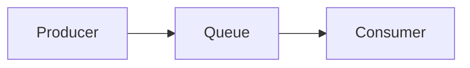

### *准备工作*

### *实战*
* *Demo1*

| Description | Test Text     |
|    :----:   |          :---: |
| 实现一个生产者生产消息到rabbitmq，一个消费者消费消息       | [Hello World](http://blog.csdn.net/guodongxiaren "悬停显示")  |

* *Demo1*
### *面试相关*

