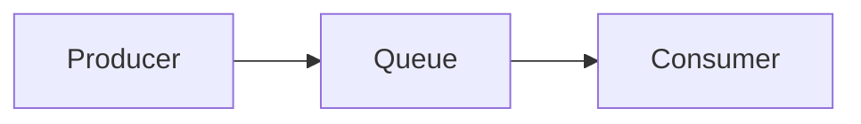

### *准备工作*

### *实战*
* *Demo1*

| 
描述
 | 代码     | 参考文档  |
|    :----:   |          :---: |  :---: |
| 实现一个生产者生产消息到rabbitmq，一个消费者消费消息       | [代码](https://github.com/zengjunhuai/Code/tree/master/MQProject/RabbitMQProject/Hellow%20World "悬停显示")  | [参考文档](https://www.yuque.com/yuqueyonghu7as8iq/ptfglx/tguuvso1rbti52by) |

* *Demo1*
### *面试相关*

<table>
    <thead>
        <tr>
            <th>名称</th>
            <th>值</th>
            <th>备注</th>
        </tr>
    </thead>
    <tbody>
       <!-- 省略 tbody 内容 -->
    </tbody>
</table>

