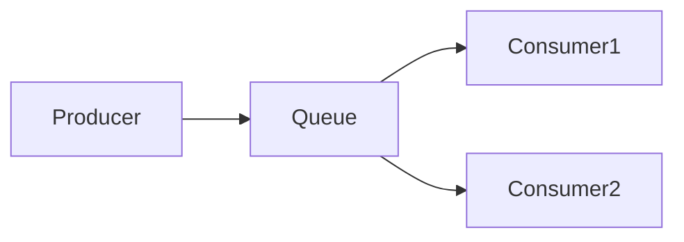

### *准备工作*

### *实战*
* *Demo0*

| 
描述
  | 代码      | 参考文档   |
|    :----:   |          :---: |  :---: |
| 实现一个生产者生产消息到rabbitmq，一个消费者消费消息       | [代码](https://github.com/zengjunhuai/Code/tree/master/MQProject/RabbitMQProject/Hellow%20World "悬停显示")  | [参考文档](https://www.yuque.com/yuqueyonghu7as8iq/ptfglx/tguuvso1rbti52by) |

* *Demo1*

| 描述  | 代码      | 参考文档   |
|    :----:   |          :---: |  :---: |
| 生产者发送4个消息，消费者1和消费者2分别分得两个消息，并且是按照有序的一个接收一次消息      | [代码](https://github.com/zengjunhuai/Code/tree/master/MQProject/RabbitMQProject/Demo1 "悬停显示")  | [参考文档](https://www.yuque.com/yuqueyonghu7as8iq/ptfglx/meu9rhvidncelqfc) |

* *Demo2*

| 描述  | 代码      | 参考文档   |
|    :----:   |          :---: |  :---: |
| 生产者发送4个消息，消费者1和消费者2分别分得两个消息，并且是按照有序的一个接收一次消息      | [代码](https://github.com/zengjunhuai/Code/tree/master/MQProject/RabbitMQProject/Demo1 "悬停显示")  | [参考文档](https://www.yuque.com/yuqueyonghu7as8iq/ptfglx/meu9rhvidncelqfc) |

### *面试相关*

<table width="">
    <thead style="display:inline-block; width: 100%; height: 20px">
        <tr>
            <th>名称</th>
            <th>值</th>
            <th>备注</th>
        </tr>
    </thead>
    <tbody style="width: 100%">
       <tr>
           <th>名称</th>
           <th>值</th>
           <th>备注</th>
       </tr>
    </tbody>
</table>

<table class=MsoTableGrid border=1 cellspacing=0 cellpadding=0
 style='border-collapse:collapse;border:none;mso-border-alt:solid windowtext .5pt;
 mso-yfti-tbllook:1184;mso-padding-alt:0cm 5.4pt 0cm 5.4pt'>
 <tr style='mso-yfti-irow:0;mso-yfti-firstrow:yes'>
  <td width=84 style='width:62.8pt;border:solid windowtext 1.0pt;mso-border-alt:
  solid windowtext .5pt;padding:0cm 5.4pt 0cm 5.4pt'>
  
描述

  </td>
  <td width=69 style='width:56.55pt;border:solid windowtext 1.0pt;border-left:
  none;mso-border-left-alt:solid windowtext .5pt;mso-border-alt:solid windowtext .5pt;
  padding:0cm 5.4pt 0cm 5.4pt'>
  
优化

  </td>
  <td width=274 style='width:217.4pt;border:solid windowtext 1.0pt;border-left:
  none;mso-border-left-alt:solid windowtext .5pt;mso-border-alt:solid windowtext .5pt;
  padding:0cm 5.4pt 0cm 5.4pt'>
  
流程图

  </td>
  <td width=114 style='width:95.25pt;border:solid windowtext 1.0pt;border-left:
  none;mso-border-left-alt:solid windowtext .5pt;mso-border-alt:solid windowtext .5pt;
  padding:0cm 5.4pt 0cm 5.4pt'>
  
代码

  </td>
  <td width=166 style='width:148.8pt;border:solid windowtext 1.0pt;border-left:
  none;mso-border-left-alt:solid windowtext .5pt;mso-border-alt:solid windowtext .5pt;
  padding:0cm 5.4pt 0cm 5.4pt'>
  
参考文档

  </td>
 </tr>
 <tr style='mso-yfti-irow:1'>
  <td width=84 style='width:62.8pt;border:solid windowtext 1.0pt;border-top:
  none;mso-border-top-alt:solid windowtext .5pt;mso-border-alt:solid windowtext .5pt;
  padding:0cm 5.4pt 0cm 5.4pt'>
  
实现一个生产者生产消息到rabbitmq，一个消费者消费消息

  </td>
  <td width=69 style='width:56.55pt;border-top:none;border-left:none;
  border-bottom:solid windowtext 1.0pt;border-right:solid windowtext 1.0pt;
  mso-border-top-alt:solid windowtext .5pt;mso-border-left-alt:solid windowtext .5pt;
  mso-border-alt:solid windowtext .5pt;padding:0cm 5.4pt 0cm 5.4pt'>
  
/

  </td>
  <td width=274 style='width:217.4pt;border-top:none;border-left:none;
  border-bottom:solid windowtext 1.0pt;border-right:solid windowtext 1.0pt;
  mso-border-top-alt:solid windowtext .5pt;mso-border-left-alt:solid windowtext .5pt;
  mso-border-alt:solid windowtext .5pt;padding:0cm 5.4pt 0cm 5.4pt'>
  
<!--[if gte vml 1]><v:shapetype
   id="_x0000_t75" coordsize="21600,21600" o:spt="75" o:preferrelative="t"
   path="m@4@5l@4@11@9@11@9@5xe" filled="f" stroked="f">
   <v:stroke joinstyle="miter"/>
   <v:formulas>
    <v:f eqn="if lineDrawn pixelLineWidth 0"/>
    <v:f eqn="sum @0 1 0"/>
    <v:f eqn="sum 0 0 @1"/>
    <v:f eqn="prod @2 1 2"/>
    <v:f eqn="prod @3 21600 pixelWidth"/>
    <v:f eqn="prod @3 21600 pixelHeight"/>
    <v:f eqn="sum @0 0 1"/>
    <v:f eqn="prod @6 1 2"/>
    <v:f eqn="prod @7 21600 pixelWidth"/>
    <v:f eqn="sum @8 21600 0"/>
    <v:f eqn="prod @7 21600 pixelHeight"/>
    <v:f eqn="sum @10 21600 0"/>
   </v:formulas>
   <v:path o:extrusionok="f" gradientshapeok="t" o:connecttype="rect"/>
   <o:lock v:ext="edit" aspectratio="t"/>
  </v:shapetype><v:shape id="_x0000_i1025" type="#_x0000_t75" style='width:138pt;
   height:26.25pt' o:ole="">
   <v:imagedata src="test1.files/image001.emz" o:title=""/>
  </v:shape><![endif]--><![if !vml]><![endif]><!--[if gte mso 9]><xml>
   <o:OLEObject Type="Embed" ProgID="Visio.Drawing.15" ShapeID="_x0000_i1025"
    DrawAspect="Content" ObjectID="_1747221669">
   </o:OLEObject>
  </xml><![endif]-->

  </td>
  <td width=114 style='width:95.25pt;border-top:none;border-left:none;
  border-bottom:solid windowtext 1.0pt;border-right:solid windowtext 1.0pt;
  mso-border-top-alt:solid windowtext .5pt;mso-border-left-alt:solid windowtext .5pt;
  mso-border-alt:solid windowtext .5pt;padding:0cm 5.4pt 0cm 5.4pt'>
  
Hello
  World

  </td>
  <td width=166 style='width:148.8pt;border-top:none;border-left:none;
  border-bottom:solid windowtext 1.0pt;border-right:solid windowtext 1.0pt;
  mso-border-top-alt:solid windowtext .5pt;mso-border-left-alt:solid windowtext .5pt;
  mso-border-alt:solid windowtext .5pt;padding:0cm 5.4pt 0cm 5.4pt'>
  
参考文档

  </td>
 </tr>
 <tr style='mso-yfti-irow:2'>
  <td width=84 rowspan=2 style='width:62.8pt;border:solid windowtext 1.0pt;
  border-top:none;mso-border-top-alt:solid windowtext .5pt;mso-border-alt:solid windowtext .5pt;
  padding:0cm 5.4pt 0cm 5.4pt'>
  
一个生产者发送4个消息，两个消费者进行接收（考虑消费者挂掉情况出现问题）

  </td>
  <td width=69 style='width:56.55pt;border-top:none;border-left:none;
  border-bottom:solid windowtext 1.0pt;border-right:solid windowtext 1.0pt;
  mso-border-top-alt:solid windowtext .5pt;mso-border-left-alt:solid windowtext .5pt;
  mso-border-alt:solid windowtext .5pt;padding:0cm 5.4pt 0cm 5.4pt'>
  
特点：（自动应答）按序接收实时消息

  
缺点：消费者挂掉，消息丢失

  </td>
  <td width=274 rowspan=2 style='width:217.4pt;border-top:none;border-left:
  none;border-bottom:solid windowtext 1.0pt;border-right:solid windowtext 1.0pt;
  mso-border-top-alt:solid windowtext .5pt;mso-border-left-alt:solid windowtext .5pt;
  mso-border-alt:solid windowtext .5pt;padding:0cm 5.4pt 0cm 5.4pt'>
  
<!--[if gte vml 1]><v:shape
   id="_x0000_i1026" type="#_x0000_t75" style='width:141.75pt;height:55.5pt'
   o:ole="">
   <v:imagedata src="test1.files/image003.emz" o:title=""/>
  </v:shape><![endif]--><![if !vml]><![endif]><!--[if gte mso 9]><xml>
   <o:OLEObject Type="Embed" ProgID="Visio.Drawing.15" ShapeID="_x0000_i1026"
    DrawAspect="Content" ObjectID="_1747221670">
   </o:OLEObject>
  </xml><![endif]-->

  </td>
  <td width=114 style='width:95.25pt;border-top:none;border-left:none;
  border-bottom:solid windowtext 1.0pt;border-right:solid windowtext 1.0pt;
  mso-border-top-alt:solid windowtext .5pt;mso-border-left-alt:solid windowtext .5pt;
  mso-border-alt:solid windowtext .5pt;padding:0cm 5.4pt 0cm 5.4pt'>
  
Demo1

  </td>
  <td width=166 style='width:148.8pt;border-top:none;border-left:none;
  border-bottom:solid windowtext 1.0pt;border-right:solid windowtext 1.0pt;
  mso-border-top-alt:solid windowtext .5pt;mso-border-left-alt:solid windowtext .5pt;
  mso-border-alt:solid windowtext .5pt;padding:0cm 5.4pt 0cm 5.4pt'>
  
参考文档

  </td>
 </tr>
 <tr style='mso-yfti-irow:3'>
  <td width=69 style='width:56.55pt;border-top:none;border-left:none;
  border-bottom:solid windowtext 1.0pt;border-right:solid windowtext 1.0pt;
  mso-border-top-alt:solid windowtext .5pt;mso-border-left-alt:solid windowtext .5pt;
  mso-border-alt:solid windowtext .5pt;padding:0cm 5.4pt 0cm 5.4pt'>
  
特点：（手动应答）按序接收延时消息，消费者挂掉，消息分配给另一消费者

  
<o:p>&nbsp;</o:p>

  </td>
  <td width=114 style='width:95.25pt;border-top:none;border-left:none;
  border-bottom:solid windowtext 1.0pt;border-right:solid windowtext 1.0pt;
  mso-border-top-alt:solid windowtext .5pt;mso-border-left-alt:solid windowtext .5pt;
  mso-border-alt:solid windowtext .5pt;padding:0cm 5.4pt 0cm 5.4pt'>
  
Demo2

  </td>
  <td width=166 style='width:148.8pt;border-top:none;border-left:none;
  border-bottom:solid windowtext 1.0pt;border-right:solid windowtext 1.0pt;
  mso-border-top-alt:solid windowtext .5pt;mso-border-left-alt:solid windowtext .5pt;
  mso-border-alt:solid windowtext .5pt;padding:0cm 5.4pt 0cm 5.4pt'>
  
<a
  href="https://www.yuque.com/yuqueyonghu7as8iq/ptfglx/yytzes8tb7487cvz">参考文档</a>

  </td>
 </tr>
 <tr style='mso-yfti-irow:4;mso-yfti-lastrow:yes'>
  <td width=84 style='width:62.8pt;border:solid windowtext 1.0pt;border-top:
  none;mso-border-top-alt:solid windowtext .5pt;mso-border-alt:solid windowtext .5pt;
  padding:0cm 5.4pt 0cm 5.4pt'>
  
<o:p>&nbsp;</o:p>

  </td>
  <td width=69 style='width:56.55pt;border-top:none;border-left:none;
  border-bottom:solid windowtext 1.0pt;border-right:solid windowtext 1.0pt;
  mso-border-top-alt:solid windowtext .5pt;mso-border-left-alt:solid windowtext .5pt;
  mso-border-alt:solid windowtext .5pt;padding:0cm 5.4pt 0cm 5.4pt'>
  
<o:p>&nbsp;</o:p>

  </td>
  <td width=274 style='width:217.4pt;border-top:none;border-left:none;
  border-bottom:solid windowtext 1.0pt;border-right:solid windowtext 1.0pt;
  mso-border-top-alt:solid windowtext .5pt;mso-border-left-alt:solid windowtext .5pt;
  mso-border-alt:solid windowtext .5pt;padding:0cm 5.4pt 0cm 5.4pt'>
  
<o:p>&nbsp;</o:p>

  </td>
  <td width=114 style='width:95.25pt;border-top:none;border-left:none;
  border-bottom:solid windowtext 1.0pt;border-right:solid windowtext 1.0pt;
  mso-border-top-alt:solid windowtext .5pt;mso-border-left-alt:solid windowtext .5pt;
  mso-border-alt:solid windowtext .5pt;padding:0cm 5.4pt 0cm 5.4pt'>
  
<o:p>&nbsp;</o:p>

  </td>
  <td width=166 style='width:148.8pt;border-top:none;border-left:none;
  border-bottom:solid windowtext 1.0pt;border-right:solid windowtext 1.0pt;
  mso-border-top-alt:solid windowtext .5pt;mso-border-left-alt:solid windowtext .5pt;
  mso-border-alt:solid windowtext .5pt;padding:0cm 5.4pt 0cm 5.4pt'>
  
<o:p>&nbsp;</o:p>

  </td>
 </tr>
</table>

