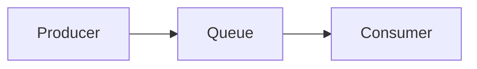
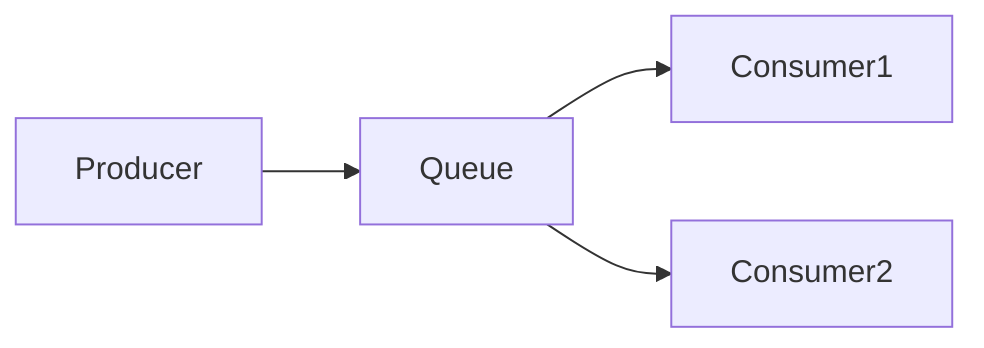
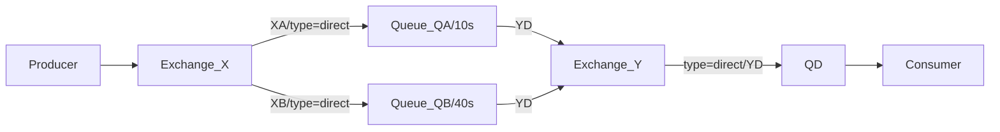
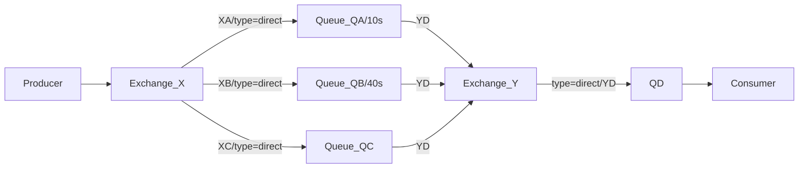
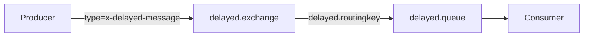

### *准备工作*

### *实战*
* *Demo0*

| 描述  | 优化  | 代码      | 参考文档   |
|    :----:   |    :----:   |          :---: |  :---: |
| 实现一个生产者生产消息到rabbitmq，一个消费者消费消息       |    /   | [代码](https://github.com/zengjunhuai/Code/tree/master/MQProject/RabbitMQProject/Hellow%20World "悬停显示")  | [参考文档](https://www.yuque.com/yuqueyonghu7as8iq/ptfglx/tguuvso1rbti52by) |

* *Demo1/Demo2*

| 描述  | 优化  | 代码      | 参考文档   |
|    :----:   |    :----:   |          :---: |  :---: |
| Demo1:生产者发送4个消息，消费者1和消费者2分别分得两个消息，并且是按照有序的一个接收一次消息      |   特点：（自动应答）消费者按序接收实时消息缺点：消费者挂掉，消息丢失|  [代码](https://github.com/zengjunhuai/Code/tree/master/MQProject/RabbitMQProject/Demo1 "悬停显示")  | [参考文档](https://www.yuque.com/yuqueyonghu7as8iq/ptfglx/meu9rhvidncelqfc) |
| Demo2:生产者发送4个消息，消费者1和消费者2分别分得两个消息，并且是按照有序的一个接收一次消息      |   特点：（手动应答）消费者按序接收延时消息，消费者挂掉，消息分配给另一消费者|  [代码](https://github.com/zengjunhuai/Code/tree/master/MQProject/RabbitMQProject/Demo1 "悬停显示")  | [参考文档](https://www.yuque.com/yuqueyonghu7as8iq/ptfglx/yytzes8tb7487cvz) |

* *Demo2*

| 描述  | 代码      | 参考文档   |
|    :----:   |          :---: |  :---: |
| 生产者发送4个消息，消费者1和消费者2分别分得两个消息，并且是按照有序的一个接收一次消息      | [代码](https://github.com/zengjunhuai/Code/tree/master/MQProject/RabbitMQProject/Demo1 "悬停显示")  | [参考文档](https://www.yuque.com/yuqueyonghu7as8iq/ptfglx/meu9rhvidncelqfc) |

* *Demo8*

* *Demo9*

* *Demo10*

* *Demo11*

* *Demo12*

* *Demo13*

* *Demo14*

### *面试相关*

