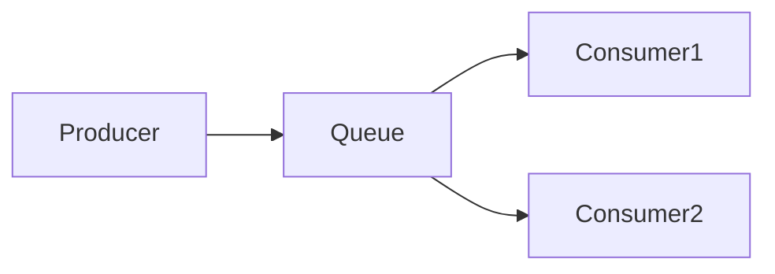
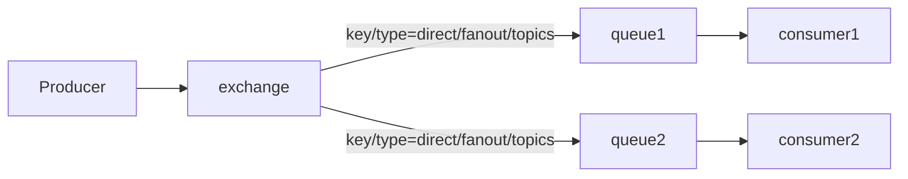
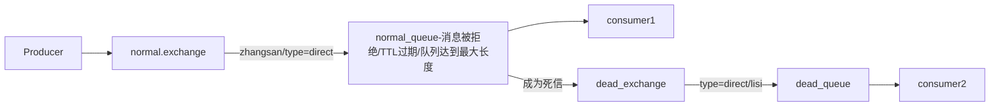
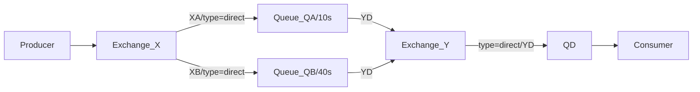
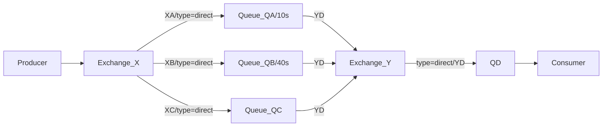

### *准备工作*
* *本文实验在VMware CentOS7 Minimal中进行，环境搭建可参考文档:*
* *VMware安装：https://www.yuque.com/yuqueyonghu7as8iq/ba4g89/rl716034hcmvwgac*
* *VMware中安装CentOS7： minimal：https://www.yuque.com/yuqueyonghu7as8iq/ba4g89/ksydyuewhtux9bg8*
* *VMware共享文件夹：https://www.yuque.com/yuqueyonghu7as8iq/ba4g89/ksydyuewhtux9bg8*
* *官网地址：https://www.rabbitmq.com/download.html*
* *安装并登录控制界面：https://www.yuque.com/yuqueyonghu7as8iq/ptfglx/rhgggfukr6tof8gy*

### *实战*
* *Demo0*

| 描述  | 优化  | 代码      | 参考文档   |
|    :----:   |    :----:   |          :---: |  :---: |
| 实现一个生产者生产消息到rabbitmq，一个消费者消费消息       |    /   | [代码](https://github.com/zengjunhuai/Code/tree/master/MQProject/RabbitMQProject/Hellow%20World "悬停显示")  | [参考文档](https://www.yuque.com/yuqueyonghu7as8iq/ptfglx/tguuvso1rbti52by) |

* *Demo1/Demo2*

| 描述  | 优化  | 代码      | 参考文档   |
|    :----:   |    :----:   |          :---: |  :---: |
| Demo1:生产者发送4个消息，消费者1和消费者2分别分得两个消息，并且是按照有序的一个接收一次消息      |   特点：（自动应答）消费者按序接收实时消息缺点：消费者挂掉，消息丢失|  [代码](https://github.com/zengjunhuai/Code/tree/master/MQProject/RabbitMQProject/Demo1 "悬停显示")  | [参考文档](https://www.yuque.com/yuqueyonghu7as8iq/ptfglx/meu9rhvidncelqfc) |
| Demo2:生产者发送4个消息，消费者1和消费者2分别分得两个消息，并且是按照有序的一个接收一次消息      |   特点：（手动应答）消费者按序接收延时消息，消费者挂掉，消息分配给另一消费者|  [代码](https://github.com/zengjunhuai/Code/tree/master/MQProject/RabbitMQProject/Demo1 "悬停显示")  | [参考文档](https://www.yuque.com/yuqueyonghu7as8iq/ptfglx/yytzes8tb7487cvz) |

* *Demo3*

| 描述  | 优化  | 代码      | 参考文档   |
|    :----:   |    :----:   |          :---: |  :---: |
| 发布确认 | 单个确认发布/批量确认发布/异步确认发布，缺点：交换机接收到消息，且无消费者消费式，消息丢失  | [代码](https://github.com/zengjunhuai/Code/tree/master/MQProject/RabbitMQProject/Demo1 "悬停显示")  | [参考文档](https://www.yuque.com/yuqueyonghu7as8iq/ptfglx/gse5n83dqy3iggom) |

* *Demo11/Demo12*
```mermaid
      flowchart LR;
           Producer-->    comfirm.exchange--key1/type=direct -->comfirm.queue--> comfirm consumer;
```
| 描述  | 优化  | 代码      | 参考文档   |
|    :----:   |    :----:   |          :---: |  :---: |
| 发布确认 | 交换机收到消息未消费丢失  |[代码]()| [参考文档](https://www.yuque.com/yuqueyonghu7as8iq/ptfglx/vpapwi87l48wx0bd) |
| 发布确认 | 优化1：回退消息给生产者  |[代码]()| [参考文档](https://www.yuque.com/yuqueyonghu7as8iq/ptfglx/vpapwi87l48wx0bd) |

* *Demo13*
```mermaid
      flowchart LR;
           Producer-->    comfirm.exchange--key1/type=direct -->comfirm.queue--> comfirm consumer;
                          comfirm.exchange--key1/type=fanout -->backup.queue--> warning consumer;
                          comfirm.exchange--key1/type=fanout -->backup.queue--> warning consumer;
```
| 描述  | 优化  | 代码      | 参考文档   |
|    :----:   |    :----:   |          :---: |  :---: |
| 发布确认 | 优化2：备份交换机  |[代码]()| [参考文档](https://www.yuque.com/yuqueyonghu7as8iq/ptfglx/vpapwi87l48wx0bd) |

* *Demo4/Demo5/Demo6*

| 描述  | 优化  | 代码      | 参考文档   |
|    :----:   |    :----:   |          :---: |  :---: |
| 展示了交换机和队列之间的不同绑定方式 | Fanout  |[代码]()| [参考文档](https://www.yuque.com/yuqueyonghu7as8iq/ptfglx/vpapwi87l48wx0bd) |
| 展示了交换机和队列之间的不同绑定方式 | Direct exchange  |[代码]()| [参考文档](https://www.yuque.com/yuqueyonghu7as8iq/ptfglx/vpapwi87l48wx0bd) |
| 展示了交换机和队列之间的不同绑定方式 | Topics  |[代码]()| [参考文档](https://www.yuque.com/yuqueyonghu7as8iq/ptfglx/vpapwi87l48wx0bd) |

* *Demo7*

| 描述  | 优化  | 代码      | 参考文档   |
|    :----:   |    :----:   |          :---: |  :---: |
| 死信队列三种来源 | 消息TTL过期，队列满了，消息被拒绝  |[代码]()| [参考文档](https://www.yuque.com/yuqueyonghu7as8iq/ptfglx/nxrbimciqxd6rtto) |


* *Demo8*

| 描述  | 优化  | 代码      | 参考文档   |
|    :----:   |    :----:   |          :---: |  :---: |
| 延迟队列 | 设置队列TTL，缺点：每增加一个新的时间需求，就要新增一个队列，这里只有10S和40S两个时间选项，如果需要一个小时后处理，那么就需要增加TTL为一个小时的队列  |[代码]()| [参考文档](https://www.yuque.com/yuqueyonghu7as8iq/ptfglx/ddt0pf7r35wcmsbo) |

* *Demo9*

| 描述  | 优化  | 代码      | 参考文档   |
|    :----:   |    :----:   |          :---: |  :---: |
| 延迟队列 | 特点：消息TTL，缺点：如果第一个消息的延时时长很长，而第二个消息的延时时长很短，第二个消息并不会优先得到执行  |[代码]()| [参考文档](https://www.yuque.com/yuqueyonghu7as8iq/ptfglx/ddt0pf7r35wcmsbo) |

* *Demo10*

| 描述  | 优化  | 代码      | 参考文档   |
|    :----:   |    :----:   |          :---: |  :---: |
| 延迟队列 | 特点：解决消息TTL问题  |[代码]()| [参考文档](https://www.yuque.com/yuqueyonghu7as8iq/ptfglx/ddt0pf7r35wcmsbo) |

* *Demo14*

| 描述  | 优化  | 代码      | 参考文档   |
|    :----:   |    :----:   |          :---: |  :---: |
| 优先级 | 特点：设置消息和队列优先级  |[代码]()| [参考文档](https://www.yuque.com/yuqueyonghu7as8iq/ptfglx/wlsly140dck5wza2) |

### *面试相关*


