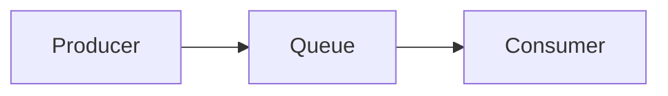
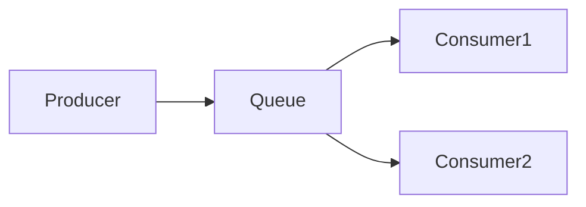

### *准备工作*

### *实战*
* *Demo0*

| 
描述
  | 代码      | 参考文档   |
|    :----:   |          :---: |  :---: |
| 实现一个生产者生产消息到rabbitmq，一个消费者消费消息       | [代码](https://github.com/zengjunhuai/Code/tree/master/MQProject/RabbitMQProject/Hellow%20World "悬停显示")  | [参考文档](https://www.yuque.com/yuqueyonghu7as8iq/ptfglx/tguuvso1rbti52by) |

* *Demo1*

| 描述  | 代码      | 参考文档   |
|    :----:   |          :---: |  :---: |
| 生产者发送4个消息，消费者1和消费者2分别分得两个消息，并且是按照有序的一个接收一次消息      | [代码](https://github.com/zengjunhuai/Code/tree/master/MQProject/RabbitMQProject/Demo1 "悬停显示")  | [参考文档](https://www.yuque.com/yuqueyonghu7as8iq/ptfglx/meu9rhvidncelqfc) |

* *Demo2*

| 描述  | 代码      | 参考文档   |
|    :----:   |          :---: |  :---: |
| 生产者发送4个消息，消费者1和消费者2分别分得两个消息，并且是按照有序的一个接收一次消息      | [代码](https://github.com/zengjunhuai/Code/tree/master/MQProject/RabbitMQProject/Demo1 "悬停显示")  | [参考文档](https://www.yuque.com/yuqueyonghu7as8iq/ptfglx/meu9rhvidncelqfc) |

### *面试相关*

    <table style="width:100%">
        <thead>
            <tr>
                <th >名称</th>
                <th >值</th>
                <th >备注</th>
            </tr>
        </thead>
        <tbody>
           <!-- 省略 tbody 内容 -->
        </tbody>
    </table>

