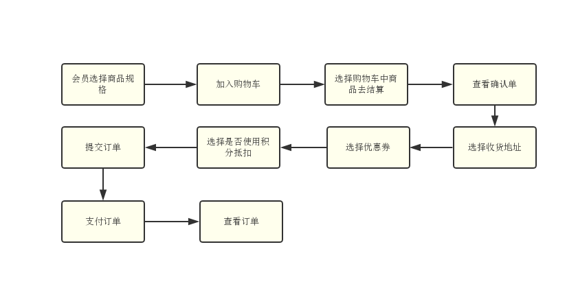
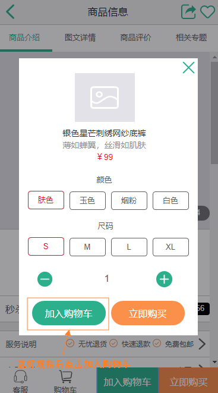
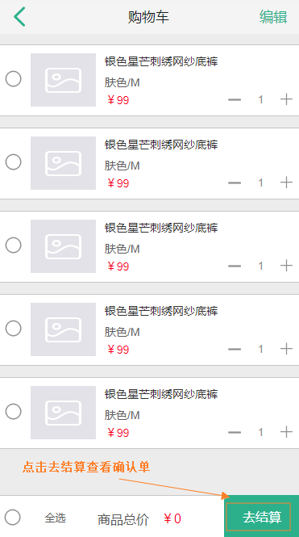
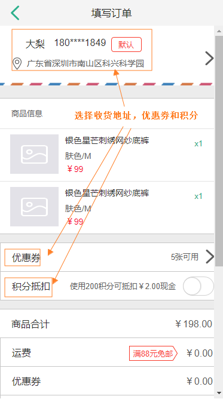
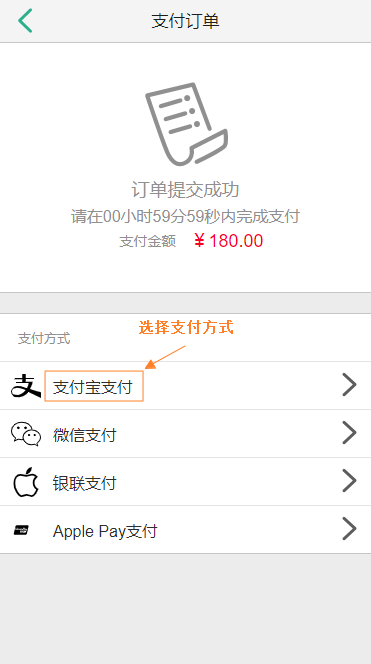
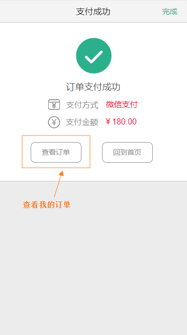
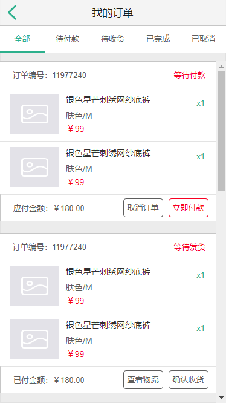
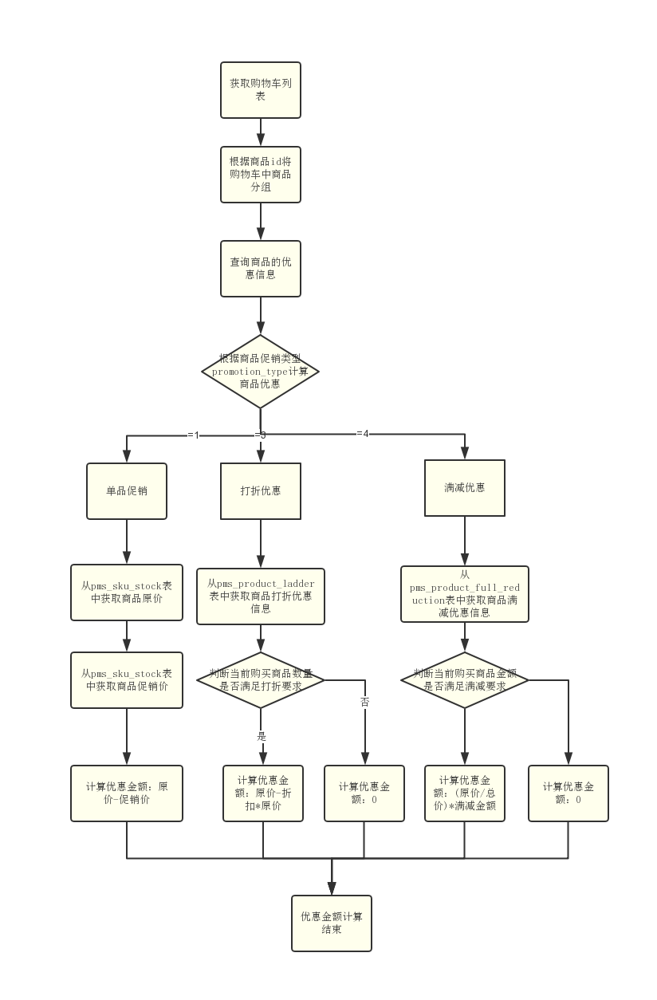
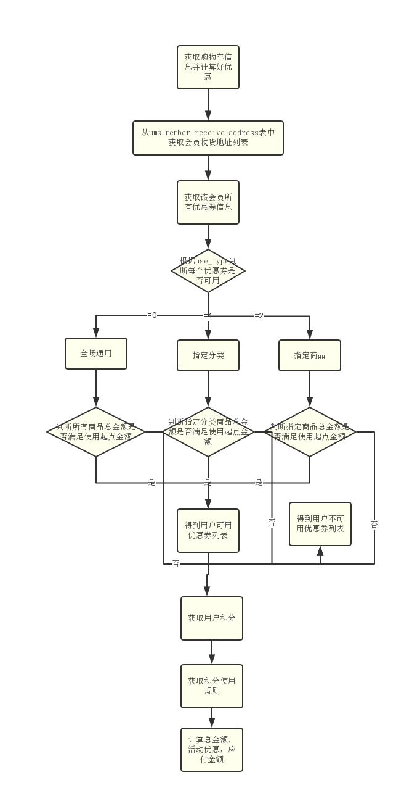

学习不走弯路，[关注公众号](#公众号) 回复「学习路线」，获取mall项目专属学习路线！

# 订单模块数据库表解析（二）

> 本文主要对购物车功能相关表进行解析，介绍从商品加入购物车到下单的整个流程，涉及购物车优惠计算流程、确认单生成流程、下单流程及取消订单流程。

## 购物车表

> 用于存储购物车中每个商品信息，可用于计算商品优惠金额。

```sql
create table oms_cart_item
(
   id                   bigint not null auto_increment,
   product_id           bigint comment '商品的id',
   product_sku_id       bigint comment '商品sku的id',
   member_id            bigint comment '会员id',
   quantity             int comment '购买数量',
   price                decimal(10,2) comment '添加到购物车的价格',
   sp1                  varchar(200) comment '销售属性1',
   sp2                  varchar(200) comment '销售属性2',
   sp3                  varchar(200) comment '销售属性3',
   product_pic          varchar(1000) comment '商品主图',
   product_name         varchar(500) comment '商品名称',
   product_brand        varchar(200) comment '商品品牌',
   product_sn           varchar(200) comment '商品的条码',
   product_sub_title    varchar(500) comment '商品副标题（卖点）',
   product_sku_code     varchar(200) comment '商品sku条码',
   member_nickname      varchar(500) comment '会员昵称',
   create_date          datetime comment '创建时间',
   modify_date          datetime comment '修改时间',
   delete_status        int(1) default 0 comment '是否删除',
   product_category_id  bigint comment '商品的分类',
   product_attr         varchar(500) comment '商品销售属性:[{"key":"颜色","value":"银色"},{"key":"容量","value":"4G"}]',
   primary key (id)
);
```

## 购物下单流程

### 整体流程示意图



### 移动端流程展示

- 会员选择商品规格  

- 选择购物车中商品去结算  

- 查看确认单  

- 支付订单  

- 支付成功  

- 查看订单  


### 实现逻辑

#### 加入购物车

> 购物车的主要功能就是存储用户选择的商品信息及计算购物车中商品的优惠。

##### 购物车优惠计算流程



##### 相关注意点

- 由于商品优惠都是以商品为单位来设计的，并不是以sku为单位设计的，所以必须以商品为单位来计算商品优惠；
- 代码实现逻辑可以参考OmsPromotionServiceImpl类中的calcCartPromotion方法。

#### 生成确认单

> 确认单主要用于用户确认下单的商品信息、优惠信息、价格信息，以及选择收货地址、选择优惠券和使用积分。

##### 生成确认单流程



##### 相关注意点

- 总金额的计算：购物车中所有商品的总价；
- 活动优惠的计算：购物车中所有商品的优惠金额累加；
- 应付金额的计算：应付金额=总金额-活动优惠；
- 代码实现逻辑可以参考OmsPortalOrderServiceImpl类中的generateConfirmOrder方法。

#### 生成订单

> 对购物车中信息进行处理，综合下单用户的信息来生成订单。

##### 下单流程


##### 相关注意点

- 库存的锁定：库存从获取购物车优惠信息时就已经从`pms_sku_stock`表中查询出来了，lock_stock字段表示锁定库存的数量，会员看到的商品数量为真实库存减去锁定库存；
- 优惠券分解金额的处理：对全场通用、指定分类、指定商品的优惠券分别进行分解金额的计算：
  - 全场通用：购物车中所有下单商品进行均摊；
  - 指定分类：购物车中对应分类的商品进行均摊；
  - 指定商品：购物车中包含的指定商品进行均摊。
- 订单中每个商品的实际支付金额计算：原价-促销优惠-优惠券抵扣-积分抵扣，促销优惠就是购物车计算优惠流程中计算出来的优惠金额；
- 订单号的生成：使用redis来生成，生成规则:8位日期+2位平台号码+2位支付方式+6位以上自增id；
- 优惠券使用完成后需要修改优惠券的使用状态；
- 代码实现逻辑可以参考OmsPortalOrderServiceImpl类中的generateOrder方法。

#### 取消订单

> 订单生成之后还需开启一个延时任务来取消超时的订单。

##### 订单取消流程


##### 相关注意点

- 代码实现逻辑可以参考OmsPortalOrderServiceImpl类中的cancelOrder方法。


## 公众号


