学习不走弯路，[关注公众号](#公众号) 回复「学习路线」，获取mall项目专属学习路线！

# 微服务架构下的自动化部署，使用Jenkins来实现！

> 之前对`mall-swarm`项目做了升级，注册中心和配置中心都改为使用Nacos，但是Jenkins的自动化部署文档一直都没更新。有些朋友参考原来的文档部署有点小问题，这次对`mall-swarm`的自动化部署文档做个升级，希望对大家有所帮助！

## Jenkins的基本使用

使用该部署方案需要对Jenkins有所了解，关于Jenkins的基本使用可以参考：[《使用Jenkins一键打包部署SpringBoot应用，就是这么6！》](https://mp.weixin.qq.com/s/tQqvgSc9cHBtnqRQSbI4aw)

## 部署准备

> 部署之前需要先安装`mall-swarm`需要的依赖服务，并打包好所有应用的Docker镜像。由于之前已经写过相关教程，这里只提示下关键的步骤，具体可以参考《mall-swarm在Linux环境下的部署（基于Docker容器）》，文档地址：http://www.macrozheng.com/#/deploy/mall_swarm_deploy_docker 。

- 需要安装好项目所需的依赖服务，直接使用`Docker Compose`安装即可，具体服务和版本信息如下；

| 组件          | 版本号 |
| ------------- | ------ |
| Mysql         | 5.7    |
| Redis         | 5.0    |
| MongoDb       | 4.3.5  |
| RabbitMq      | 3.7.15 |
| Nginx         | 1.10   |
| Elasticsearch | 7.6.2  |
| Logstash      | 7.6.2  |
| Kibana        | 7.6.2  |
| Nacos         | 1.3.0  |

- 打包好所有SpringBoot应用的Docker镜像，具体应用服务信息如下；

| 应用         | 说明         |
| ------------ | ------------ |
| mall-monitor | 监控中心     |
| mall-gateway | 微服务网关   |
| mall-auth    | 认证中心     |
| mall-admin   | 商城后台服务 |
| mall-portal  | 商城前台服务 |
| mall-search  | 商城搜索服务 |

- 将应用所有配置添加到Nacos注册中心中去，具体配置文件如下。

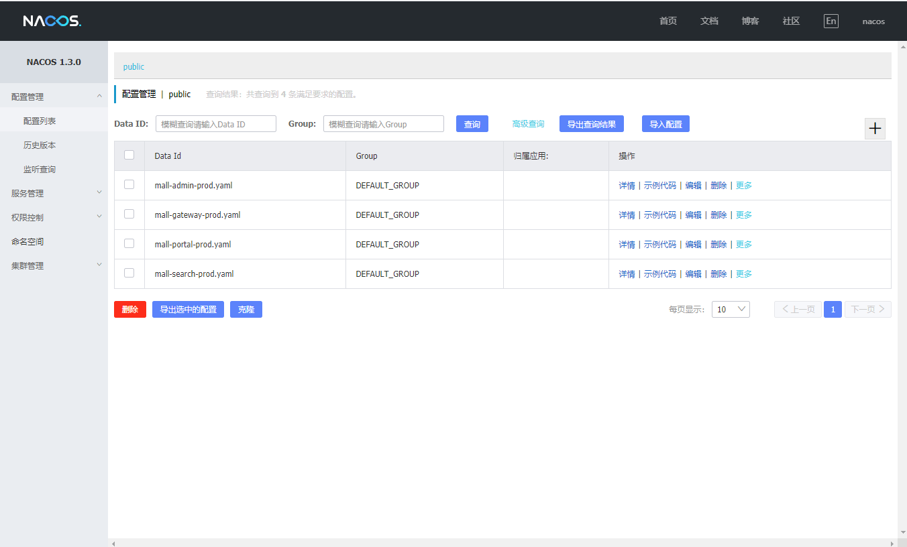

## 执行脚本准备

> Jenkins自动化部署是需要依赖Linux执行脚本的，我们先把需要执行的脚本准备好。

- 脚本文件都存放在了`mall-swarm`项目的`/document/sh`目录下：

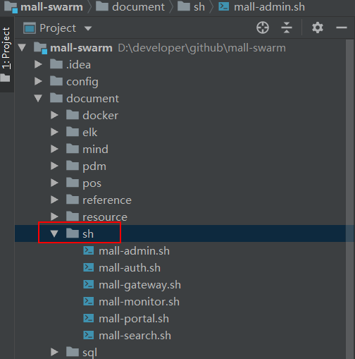

- 上传脚本前在IDEA中修改所有脚本文件的换行符格式为`LF`，否则脚本会无法执行；

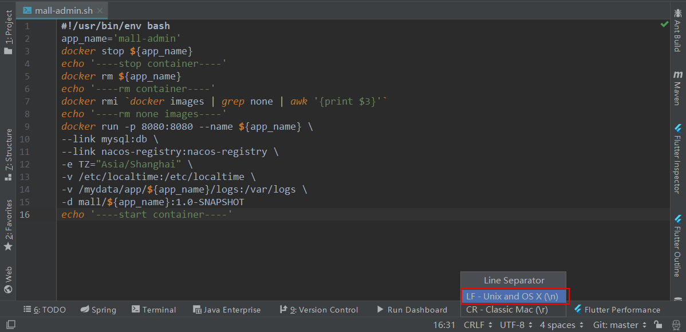

- 将所有脚本文件上传到指定目录，这里我们上传到`/mydata/sh`目录下；


- 将所有脚本文件都修改为可执行文件:

```bash
chmod +x ./mall-*
```


## Jenkins中创建任务

> 接下来我们将通过在Jenkins中创建任务来实现自动化部署。由于我们的`mall-swarm`是个多模块的项目，部署上面和曾经的单模块项目还是有所区别的。

### mall-admin

> 由于各个模块执行任务的创建都大同小异，下面将详细讲解`mall-admin`模块任务的创建，其他模块将简略讲解。

- 首先我们选择`构建一个自由风格的软件项目`，然后输入任务名称为`mall-admin`，配置其Git仓库地址，这里我直接使用了Gitee上面的地址：

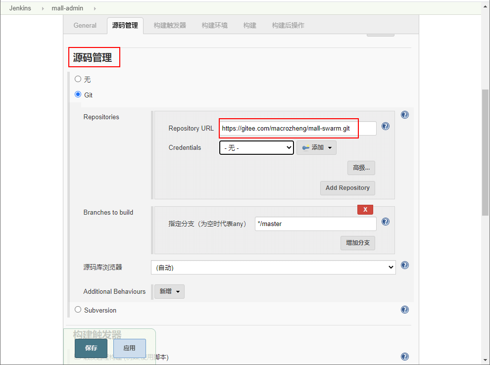

- 之后我们创建一个构建，构建`mall-swarm`项目中的依赖模块，否则当构建可运行的服务模块时会因为无法找到这些模块而构建失败；

```bash
# 只install mall-common,mall-mbg两个模块
clean install -pl mall-common,mall-mbg -am
```

- 依赖模块构建示意图：

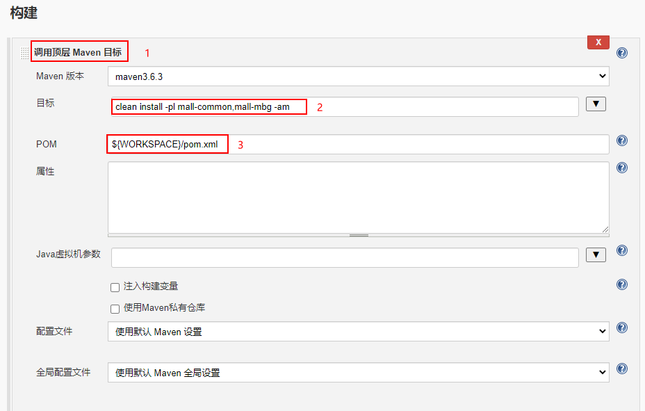

- 再创建一个构建，单独构建并打包`mall-admin`模块：

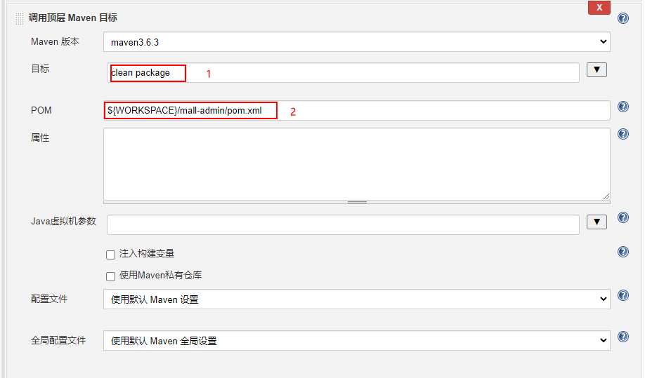

- 再创建一个构建，通过SSH去执行`sh`脚本，这里执行的是`mall-admin`的运行脚本：

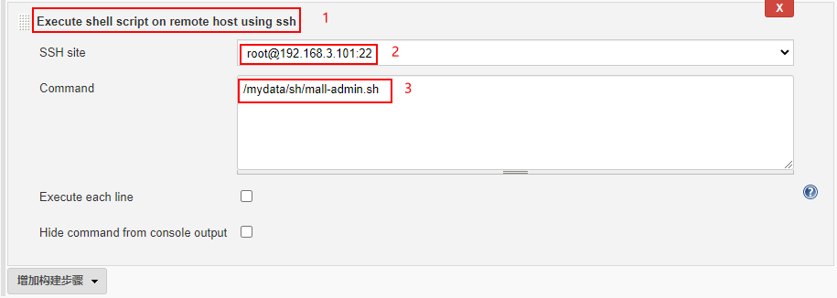

- 点击保存，完成mall-admin的执行任务创建。

### mall-gateway

> `mall-gateway`和其他模块与`mall-admin`的创建任务方式基本一致，只需修改构建模块时的`pom.xml`文件位置和`执行脚本`位置即可。

- 我们可以直接从`mall-admin`模块的任务复制一个过来创建：

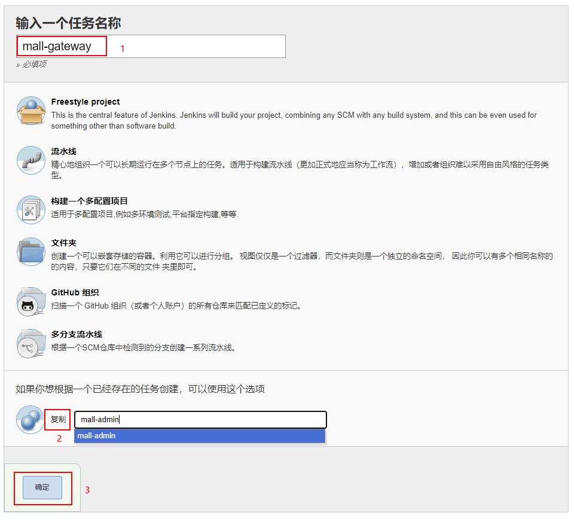

- 修改第二个构建中的`pom.xml`文件位置，改为：`${WORKSPACE}/mall-gateway/pom.xml`

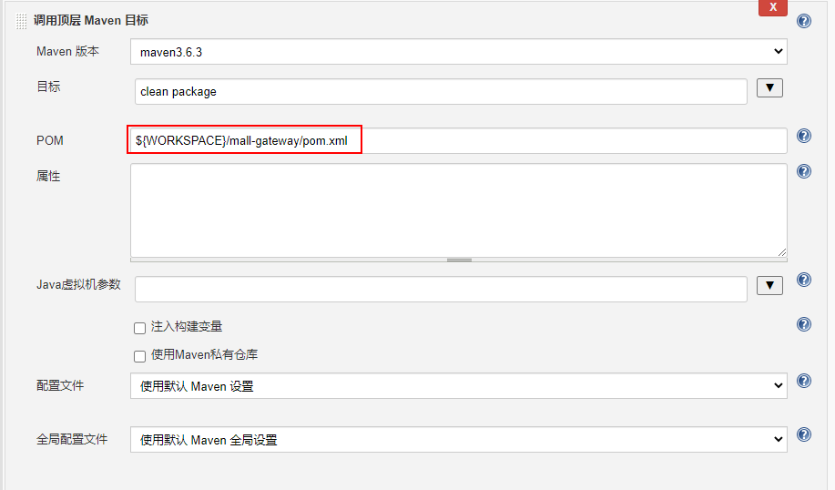

- 修改第三个构建中的SSH执行脚本文件位置，改为：`/mydata/sh/mall-gateway.sh`

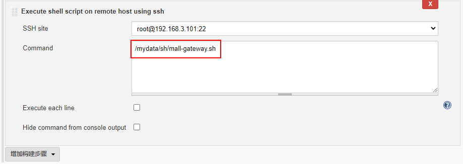

- 点击保存，完成mall-gateway的执行任务创建。

### 其他模块

其他模块的执行任务创建，参考`mall-admin`和`mall-gateway`的创建即可。

### 任务创建完成

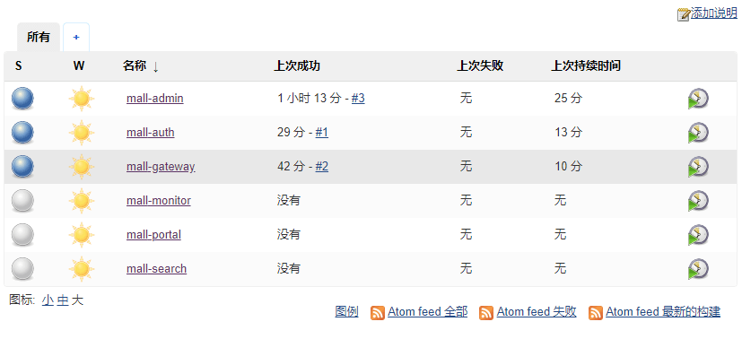

## Docker网络问题

> 如果之前使用的是`Docker Compose`启动所有依赖服务，会默认创建一个网络，所有的依赖服务都会在此网络之中，不同网络内的服务无法互相访问。我这里创建的网络是`deploy_default`，所以需要指定`sh`脚本中服务运行的的网络，否则启动的应用服务会无法连接到依赖服务。

- 可以使用`docker inspect mysql`命令来查看mysql服务所在的网络；

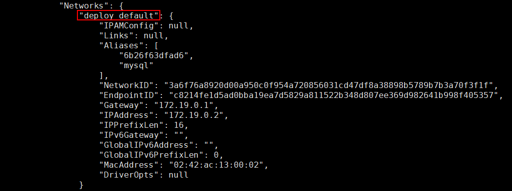

- 也可以通过`docker network ls`来查看所有网络；

```bash
[root@local-linux ~]# docker network ls
NETWORK ID          NAME                     DRIVER              SCOPE
59b309a5c12f        bridge                   bridge              local
3a6f76a8920d        deploy_default           bridge              local
ef34fe69992b        host                     host                local
a65be030c632        none     
```

- 修改所有`sh`脚本，修改服务运行的网络，添加一行`--network deploy_default \`即可。

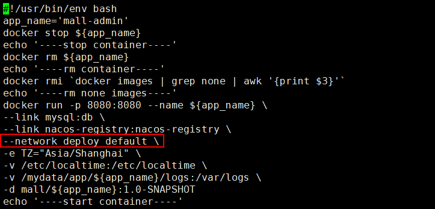

## 模块启动顺序问题

> 由于作为注册中心和配置中心的Nacos已经启动了，其他模块基本没有启动顺序的限制，但是最好还是按照下面的顺序启动。

推荐启动顺序：

- mall-auth
- mall-gateway
- mall-monitor
- mall-admin
- mall-portal
- mall-search

## 运行完成效果展示

- 查看API文档信息，访问地址：http://192.168.3.101:8201/doc.html

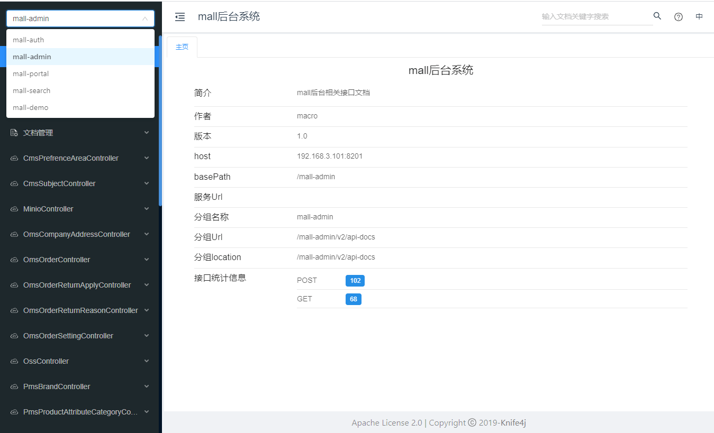

- 查看注册中心注册服务信息，访问地址：http://192.168.3.101:8848/nacos/


- 监控中心应用信息，访问地址：http://192.168.3.101:8101

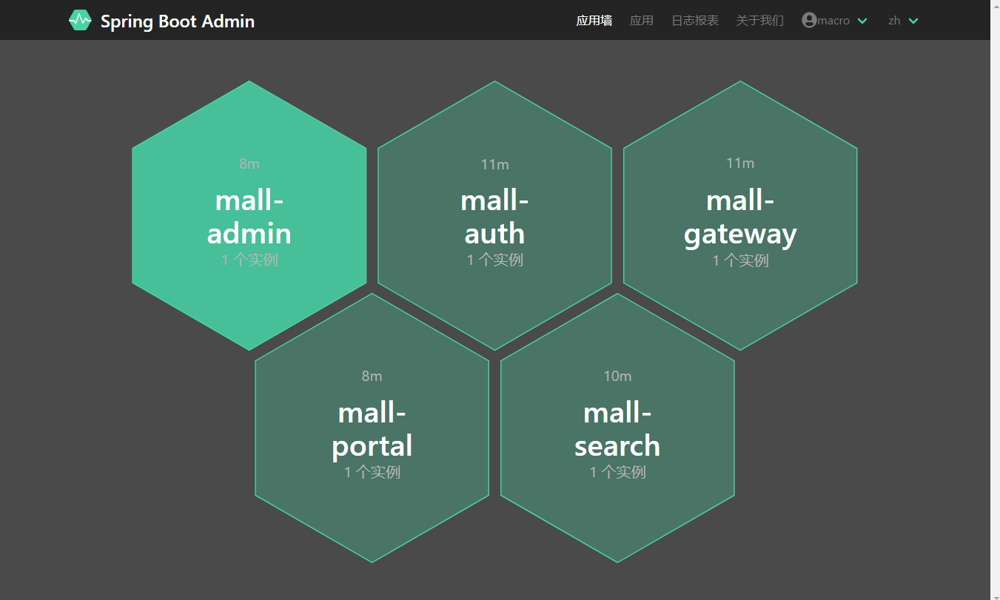

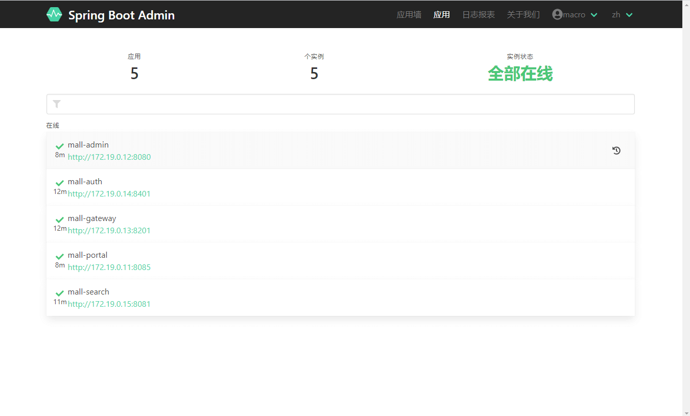

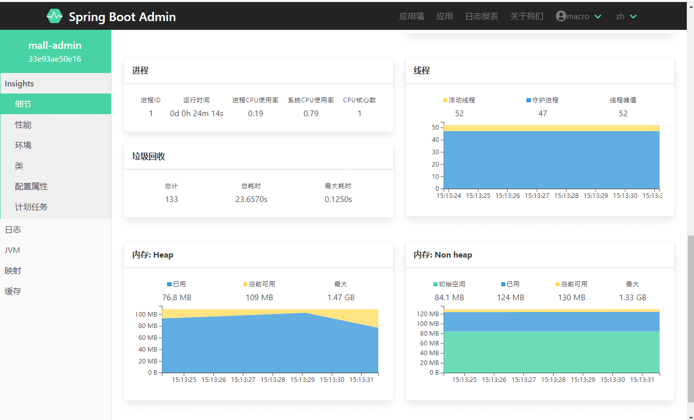

- 日志收集系统信息，访问地址：http://192.168.3.101:5601

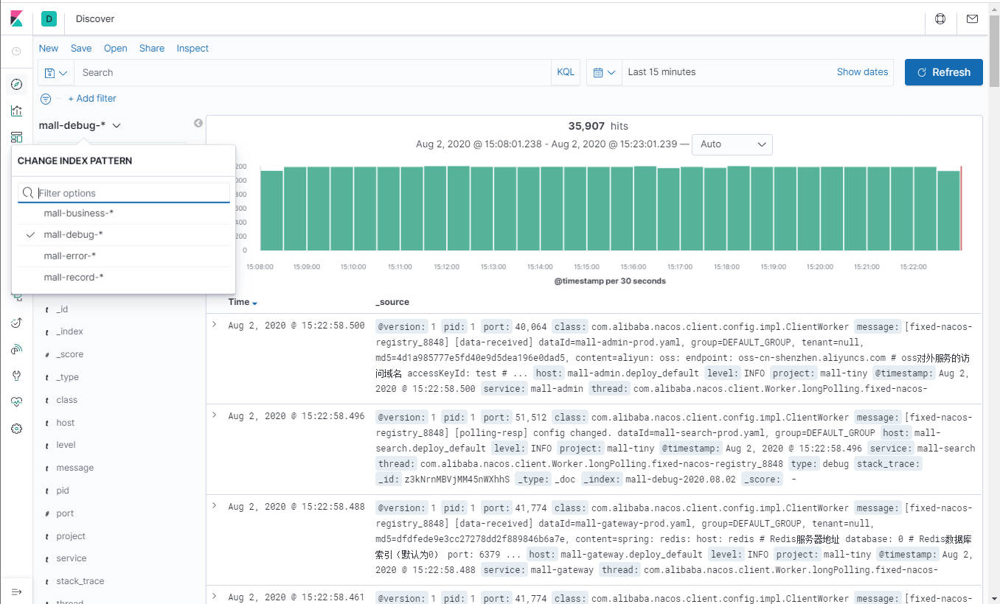

## 总结

我们通过在Jenkins中创建任务，完成了`mall-swarm`项目的自动化部署工作，这样当我们每次修改完代码后，只需点击启动任务，就可以实现一键打包部署，省去了频繁打包部署的麻烦。

## 公众号


