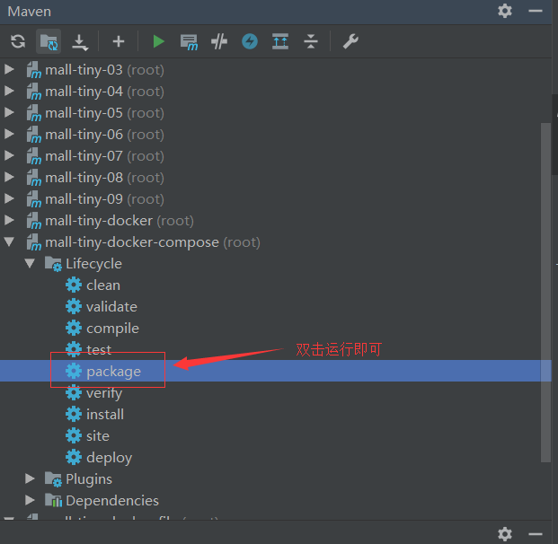

学习不走弯路，[关注公众号](#公众号) 回复「学习路线」，获取mall项目专属学习路线！

# 使用Docker Compose部署SpringBoot应用

> Docker Compose是一个用于定义和运行多个docker容器应用的工具。使用Compose你可以用YAML文件来配置你的应用服务，然后使用一个命令，你就可以部署你配置的所有服务了。

## 安装

### 下载Docker Compose

```bash
curl -L https://get.daocloud.io/docker/compose/releases/download/1.24.0/docker-compose-`uname -s`-`uname -m` > /usr/local/bin/docker-compose
```

### 修改该文件的权限为可执行

```bash
chmod +x /usr/local/bin/docker-compose
```

### 查看是否已经安装成功

```bash
docker-compose --version
```


## 使用Docker Compose的步骤

- 使用Dockerfile定义应用程序环境，一般需要修改初始镜像行为时才需要使用；
- 使用docker-compose.yml定义需要部署的应用程序服务，以便执行脚本一次性部署；
- 使用docker-compose up命令将所有应用服务一次性部署起来。

## docker-compose.yml常用命令

### image

指定运行的镜像名称

```yaml
# 运行的是mysql5.7的镜像
image: mysql:5.7
```

### container_name

配置容器名称

```yaml
# 容器名称为mysql
container_name: mysql
```

### ports

指定宿主机和容器的端口映射（HOST:CONTAINER）

```yaml
# 将宿主机的3306端口映射到容器的3306端口
ports:
  - 3306:3306
```

### volumes

将宿主机的文件或目录挂载到容器中（HOST:CONTAINER）

```yaml
# 将外部文件挂载到myql容器中
volumes:
  - /mydata/mysql/log:/var/log/mysql
  - /mydata/mysql/data:/var/lib/mysql
  - /mydata/mysql/conf:/etc/mysql
```

### environment

配置环境变量

```yaml
# 设置mysqlroot帐号密码的环境变量
environment:
  - MYSQL_ROOT_PASSWORD=root
```

### links

连接其他容器的服务（SERVICE:ALIAS）
```yaml
# 可以以database为域名访问服务名称为db的容器
links:
  - db:database
```

## Docker Compose常用命令

### 构建、创建、启动相关容器

```bash
# -d表示在后台运行
docker-compose up -d
```

### 指定文件启动

```bash
docker-compose -f docker-compose.yml up -d
```

### 停止所有相关容器

```bash
docker-compose stop
```

### 列出所有容器信息

```bash
docker-compose ps
```

## 使用Docker Compose 部署应用

### 编写docker-compose.yml文件

> Docker Compose将所管理的容器分为三层，工程、服务及容器。docker-compose.yml中定义所有服务组成了一个工程，services节点下即为服务，服务之下为容器。容器与容器直之间可以以服务名称为域名进行访问，比如在mall-tiny-docker-compose服务中可以通过jdbc:mysql://db:3306这个地址来访问db这个mysql服务。

```yaml
version: '3'
services:
  # 指定服务名称
  db:
    # 指定服务使用的镜像
    image: mysql:5.7
    # 指定容器名称
    container_name: mysql
    # 指定服务运行的端口
    ports:
      - 3306:3306
    # 指定容器中需要挂载的文件
    volumes:
      - /mydata/mysql/log:/var/log/mysql
      - /mydata/mysql/data:/var/lib/mysql
      - /mydata/mysql/conf:/etc/mysql
    # 指定容器的环境变量
    environment:
      - MYSQL_ROOT_PASSWORD=root
  # 指定服务名称
  mall-tiny-docker-compose:
    # 指定服务使用的镜像
    image: mall-tiny/mall-tiny-docker-compose:0.0.1-SNAPSHOT
    # 指定容器名称
    container_name: mall-tiny-docker-compose
    # 指定服务运行的端口
    ports:
      - 8080:8080
    # 指定容器中需要挂载的文件
    volumes:
      - /etc/localtime:/etc/localtime
      - /mydata/app/mall-tiny-docker-compose/logs:/var/logs
```

**注意：如果遇到mall-tiny-docker-compose服务无法连接到mysql，需要在mysql中建立mall数据库，同时导入mall.sql脚本。具体参考[使用Dockerfile为SpringBoot应用构建Docker镜像](https://mp.weixin.qq.com/s/U_OcNMpLAJJum_s9jbZLGg)中的运行mysql服务并设置部分。**

### 使用maven插件构建mall-tiny-docker-compose镜像



**注意：构建有问题的可以参考[使用Maven插件为SpringBoot应用构建Docker镜像](https://mp.weixin.qq.com/s/q2KDzHbPkf3Q0EY8qYjYgw)**

### 运行Docker Compose命令启动所有服务
先将docker-compose.yml上传至Linux服务器，再在当前目录下运行如下命令：

```bash
docker-compose up -d
```


访问接口文档地址http://192.168.3.101:8080/swagger-ui.html：


## 项目源码地址

[https://github.com/macrozheng/mall-learning/tree/master/mall-tiny-docker-compose](https://github.com/macrozheng/mall-learning/tree/master/mall-tiny-docker-compose)

## 公众号


