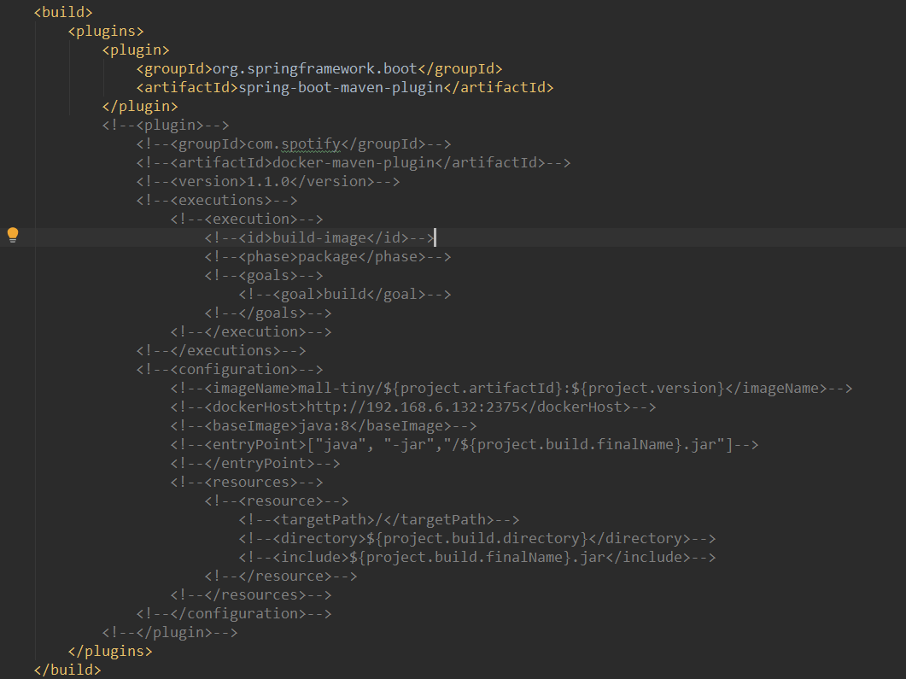
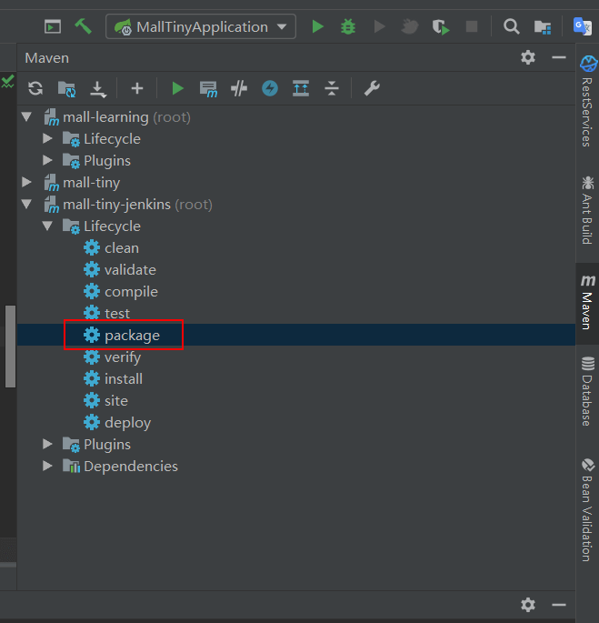
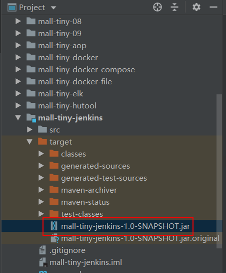
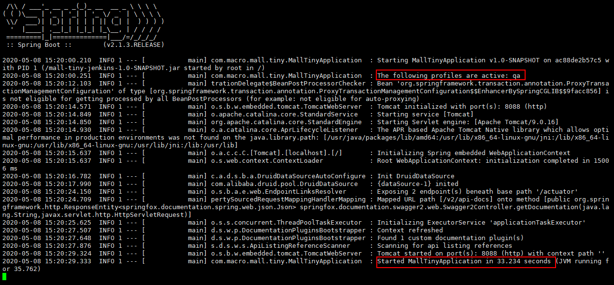
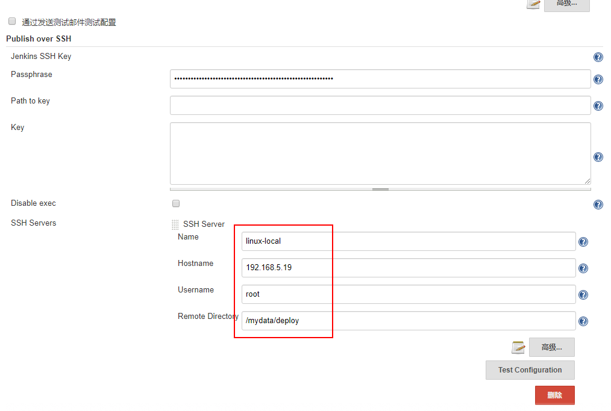
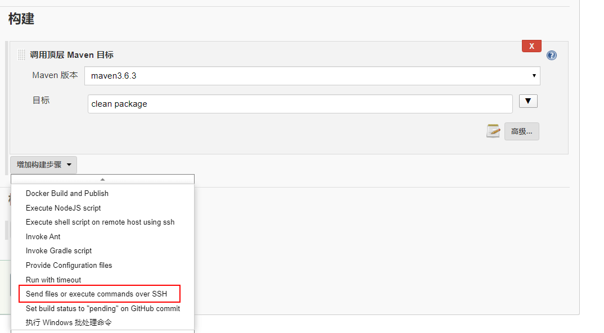
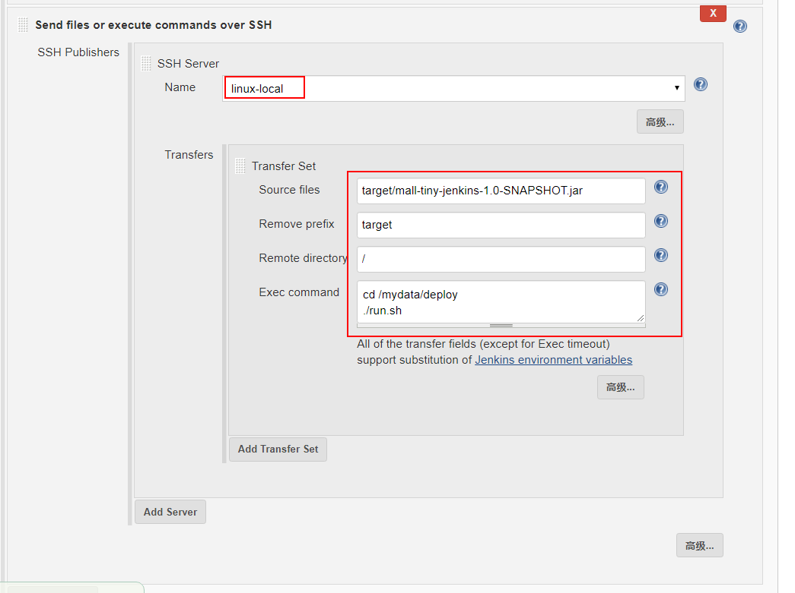
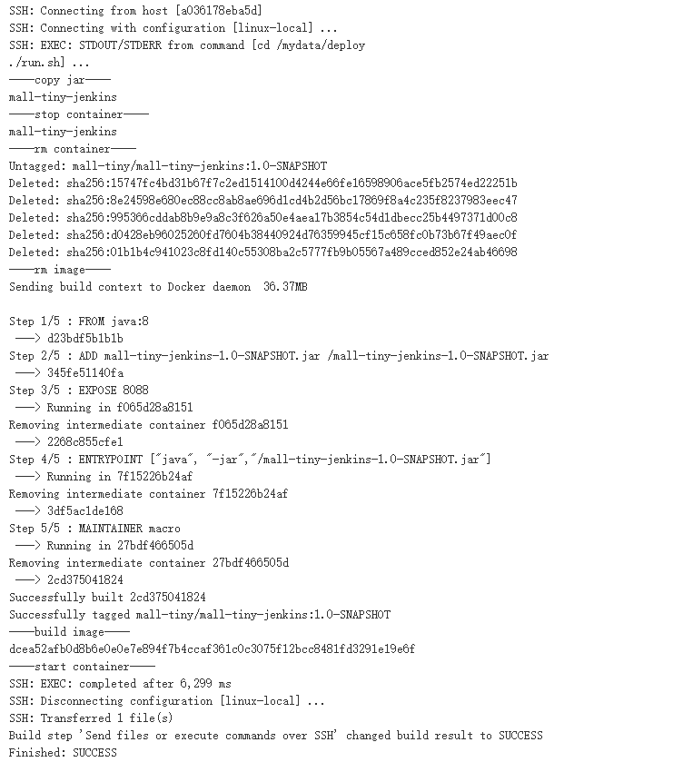

学习不走弯路，[关注公众号](#公众号) 回复「学习路线」，获取mall项目专属学习路线！

# 我常用的自动化部署技巧，贼好用，推荐给大家！

> SpringBoot+Jenkins自动化部署技巧，远程部署同样适用，附通用自动化脚本！本文将从半自动化部署讲起，到自动化部署，讲解一套生产环境切实可用的自动化部署方案！

## 半自动化部署

> 之前写过的SpringBoot应用打包Docker镜像都是通过Maven插件来实现的，由于远程服务器需要开发2375端口，存在一定的安全隐患。这次介绍另一种方法，使用DockerFile+Jar+自动化脚本的形式来部署。由于需要一定的手动操作，我把它称之为半自动化部署。

### 项目打包

- 这次我们不使用Docker的Maven插件来打包，先在`pom.xml`中注释掉它；



- 然后使用Maven的package命令直接将应用打成Jar包；



- 此时在`target`目录下就会生成一个Jar包，我们打包Docker镜像的时候会用到它。



### DockerFile

主要是定义了如何将Jar包打包成Docker镜像，对DockerFile不了解的朋友可以看下[《使用Dockerfile为SpringBoot应用构建Docker镜像》](https://mp.weixin.qq.com/s/U_OcNMpLAJJum_s9jbZLGg)，具体内容如下。

```dockerfile
# 该镜像需要依赖的基础镜像
FROM java:8
# 将当前目录下的jar包复制到docker容器的/目录下
ADD mall-tiny-jenkins-1.0-SNAPSHOT.jar /mall-tiny-jenkins-1.0-SNAPSHOT.jar
# 声明服务运行在8088端口
EXPOSE 8088
# 指定docker容器启动时运行jar包
ENTRYPOINT ["java", "-jar","/mall-tiny-jenkins-1.0-SNAPSHOT.jar"]
# 指定维护者的名字
MAINTAINER macro
```

### 自动化脚本

可以作为通用脚本来使用的模板脚本，只需改变其中的一些参数即可，具体执行流程为：停止旧服务->删除旧容器->删除旧镜像->打包新镜像->运行新镜像。

```bash
#!/usr/bin/env bash
# 定义应用组名
group_name='mall-tiny'
# 定义应用名称
app_name='mall-tiny-jenkins'
# 定义应用版本
app_version='1.0-SNAPSHOT'
# 定义应用环境
profile_active='qa'
echo '----copy jar----'
docker stop ${app_name}
echo '----stop container----'
docker rm ${app_name}
echo '----rm container----'
docker rmi ${group_name}/${app_name}:${app_version}
echo '----rm image----'
# 打包编译docker镜像
docker build -t ${group_name}/${app_name}:${app_version} .
echo '----build image----'
docker run -p 8088:8088 --name ${app_name} \
--link mysql:db \
-e 'spring.profiles.active'=${profile_active} \
-e TZ="Asia/Shanghai" \
-v /etc/localtime:/etc/localtime \
-v /mydata/app/${app_name}/logs:/var/logs \
-d ${group_name}/${app_name}:${app_version}
echo '----start container----'
```

下面讲下自动化脚本里面值得注意的地方：

- `group_name`、`app_name`、`app_version`可以用来定义打包镜像的属性；
- `profile_active`可以让你的应用使用不同环境下的配置，比如使用`qa`可以启用测试环境的配置，使用`prod`可以启用生产环境配置，真正的一包多用；
- `docker rmi`这步一定要有，如果不删除旧镜像，当新镜像打包的时候会产生`none`镜像；
- `docker run`命令中的`-e TZ="Asia/Shanghai"`时区一定要设置，否则容器时间会和宿主机会相差8个小时。

### 部署运行

- 直接上传我们的应用Jar包、DockerFile文件和自动化部署脚本到指定目录下；


- 将自动化脚本修改为可执行；

```bash
chmod +x run.sh
```

- 使用`./run.sh`命令直接运行脚本即可。



## 结合Jenkins自动化部署

> 之前的打包、上传文件都是我们手动完成的，其实这些操作也可以让Jenkins来帮我们实现，有了Jenkins才算得上是真正的自动化部署！

### 学前准备

学习下面的内容需要对Jenkins有一定的了解，不了解的朋友可以看下：[《使用Jenkins一键打包部署SpringBoot应用，就是这么6！》](https://mp.weixin.qq.com/s/tQqvgSc9cHBtnqRQSbI4aw)

### Publish Over SSH

这里推荐安装这款Jenkins插件，它的主要作用是可以通过SSH在不同服务器之间传输文件和执行命令。比如说我们把Jenkins装在了测试服务器上，我们可以使用Jenkins在测试服务器上从Git仓库获取代码，然后打成Jar包。打包完成后我们可以通过这个插件将Jar包传输到正式服务器上去，然后执行正式服务器上的自动化脚本，从而实现正式服务器上的自动化部署。

- 首先我们可以在`系统管理->插件管理`中找到该插件，然后进行安装；


- 然后在`系统管理->插件管理`中添加相应的SSH配置；



- 配置完成后创建一个应用的构建任务，`源码管理`和`构建`中的Maven打包配置和之前的Jenkins教程中一样，只有最后一步不同，添加构建步骤为`通过SSH发送文件并执行命令`;



- 配置好我们的`SSH Publisher`，主要是源文件路径和目标文件路径，以及需要执行的脚本；



- 之后执行构建任务即可实现自动化部署了，此方法在两台不同服务器之间同样适用！



## 总结

从我写过的几篇自动化部署文章中，其实可以看出，Linux下的自动化部署主要是依靠一连串的Linux命令来实现的。Jenkins的自动化部署也是基于这些的，所以要学会自动化部署，Linux命令和Docker命令是必不可少的！

## 项目源码地址

https://github.com/macrozheng/mall-learning/tree/master/mall-tiny-jenkins

## 公众号

